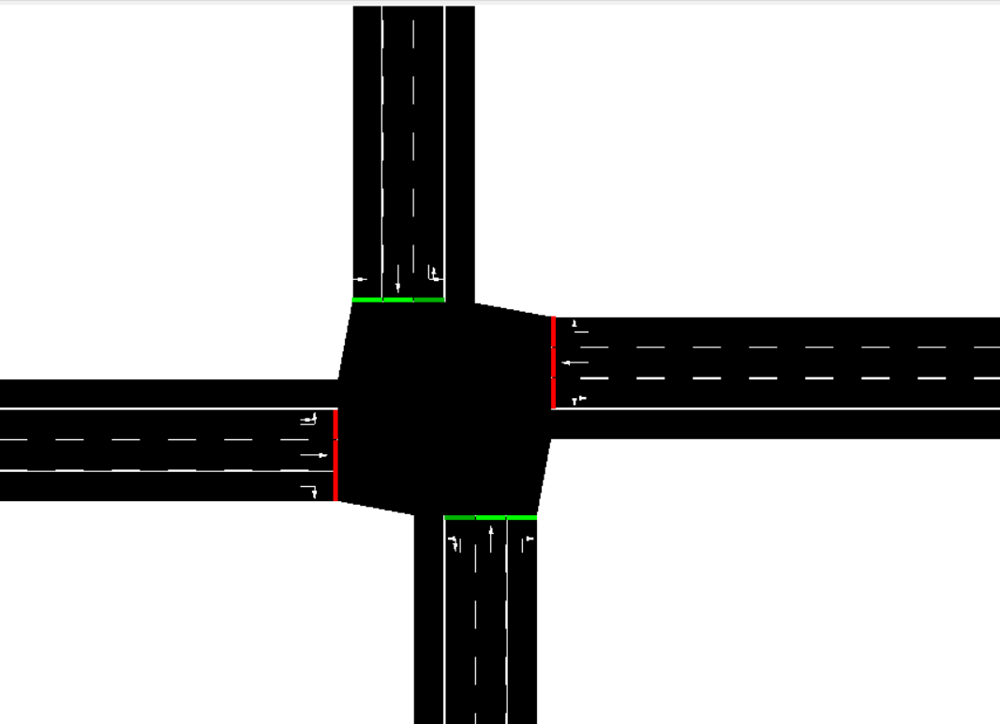
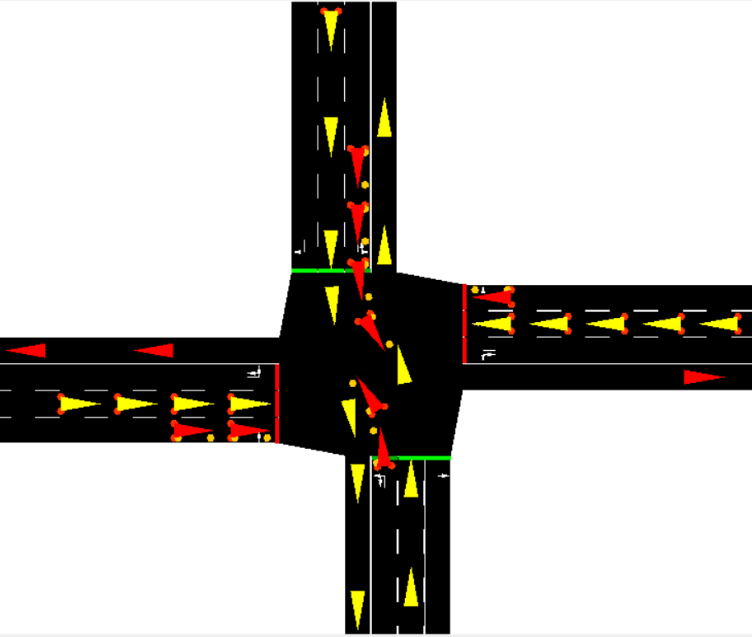
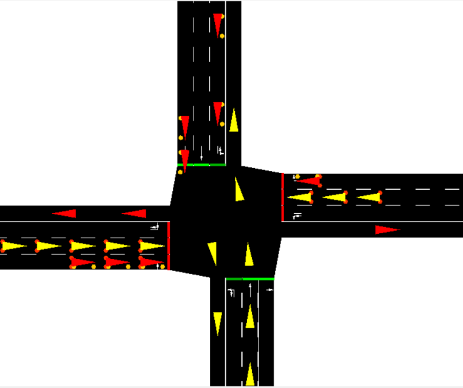
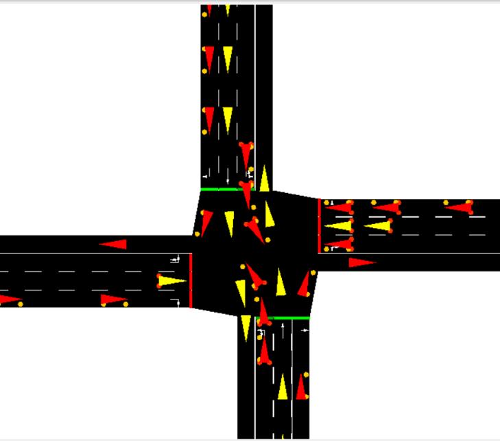

# traffic_signal_control
*Have you ever been stuck in traffic for way longer than expected due to an inefficient signal control system working on timing control?*

Earlier, I used to blame my luck for being stuck in traffic. However, on diving deep into this problem, I realised that all we need is an intelligent system to control the signals and maintain the flow according to the rush at a particular road. Frustrated by this problem we occasionally face in our daily life, Anam and I decided to work on this quixotic idea, and we are proud of the results achieved.

### What did we develop?
We developed a solution which uses Q-Learning and employs principles of deep learning to find optimal duration for traffic signals at a junction based on the current state. The Q values (state-action pairs) are updated continuously until an optimal timing state is achieved.

### The Learning Mechanism
The framework Q-learning with deep neural network makes use of the agent to control traffic signal to minimise waiting time for a 4-way intersection with 1 incoming lane and 3  outgoing lanes. The agent make use of the Q-learning equation *Q(s,a) = reward + gamma • max Q'(s',a')* to update the action values and a deep neural network to learn the state-action function. Experience relay  mechanism is implemented for updating cumulative waiting time between actions. The agent stores in memory the previous value, and at the end of each episode, that value is extracted and is used to train the neural network. The first layer of the neural network has 16 filters of 4x4 with stride 2 and it applies ReLU as the activation. The second layer has 32 filters of size 2x2 with stride 1 and also applies ReLU. The third and fourth layers are fully connected layers of size 128 and 64 respectively. Final layer is a linear layer that outputs Q values corresponding to every possible action that agent takes. Our goal is to approximate the Q-learning equation by training the neural network.

### Steps to run
1. Clone the repo 
2. Download SUMO from [here](https://sumo.dlr.de/docs/Downloads.php) - this is where the simulations will take place
3. Load the SUMO Config file on to the simulator
4. Run *traffic_light_control.py*
### Screenshots
#### Initial State

#### Active Simulation on SUMO

### Results
Using our agent, we were able to achieve a best total waiting time of 126k seconds. The average total waiting time was 190k seconds, which is a significant improvement from the waiting time of static traffic lights which stands at 330k seconds. Our model shows a 61.8% improvement from the traditional system of traffic light control.

